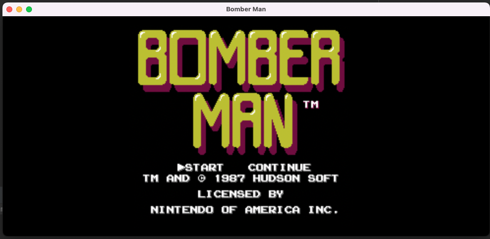
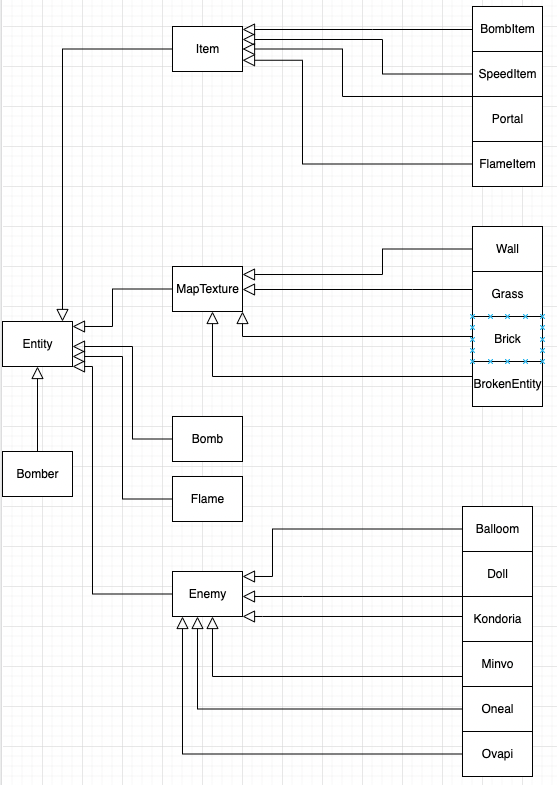

# Bài tập lớn OOP - Bomberman Game

Phát triển game Bomberman kinh điển của NES.

## Demo
### In Game

### Title Menu

### Inheritance tree

## Các thành viên và nhiệm vụ
- Nguyễn Hải Nam(Leader) [haiNam2711](https://github.com/haiNam2711)
  * Contribute: Core game, Algorithm.
- Trần Thị Vân Anh [Hnanav](https://github.com/Hnanav)
  * Contribute: Enemies, Read Map.

